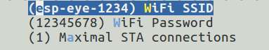
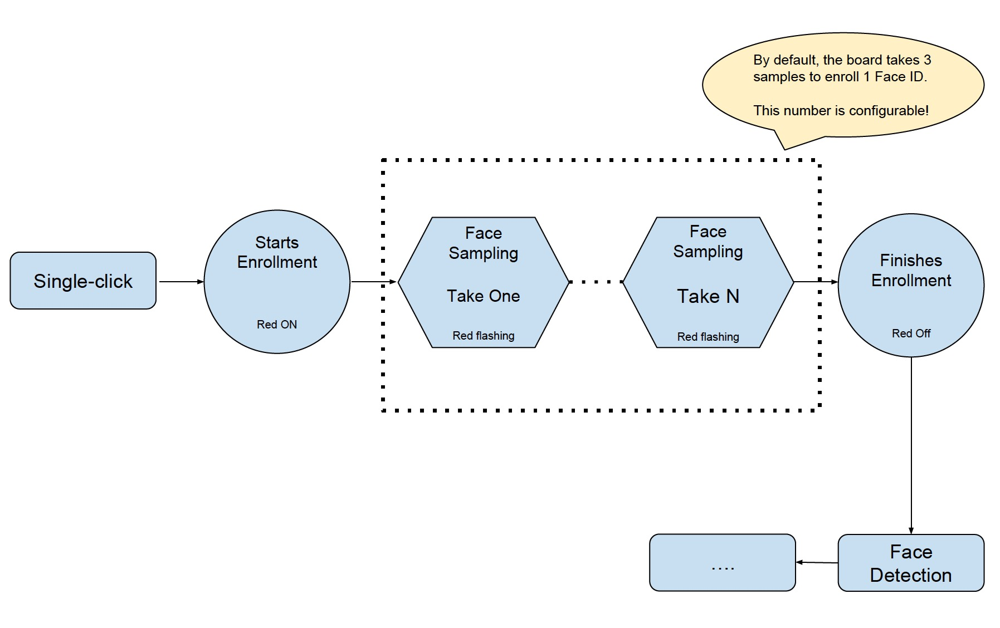
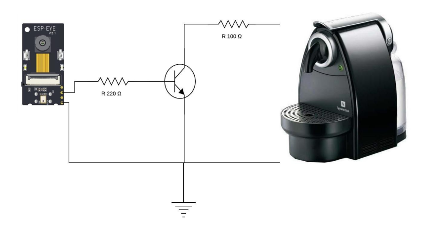
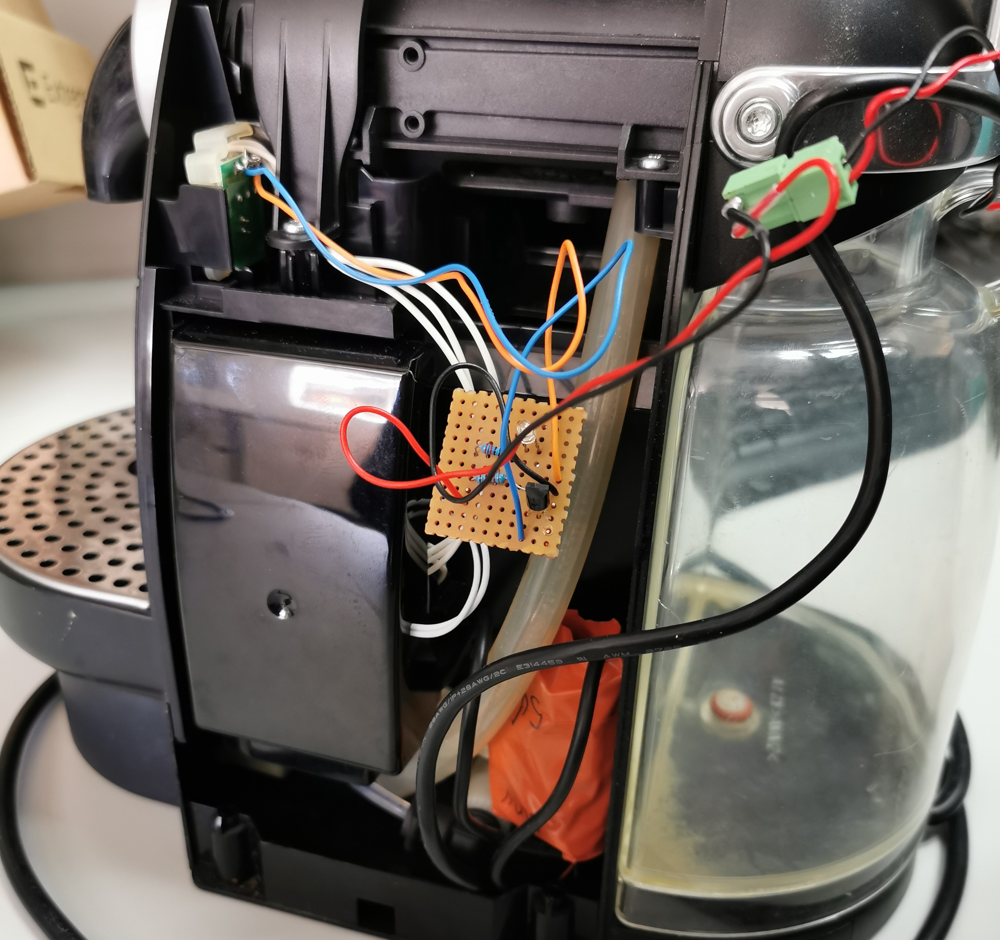
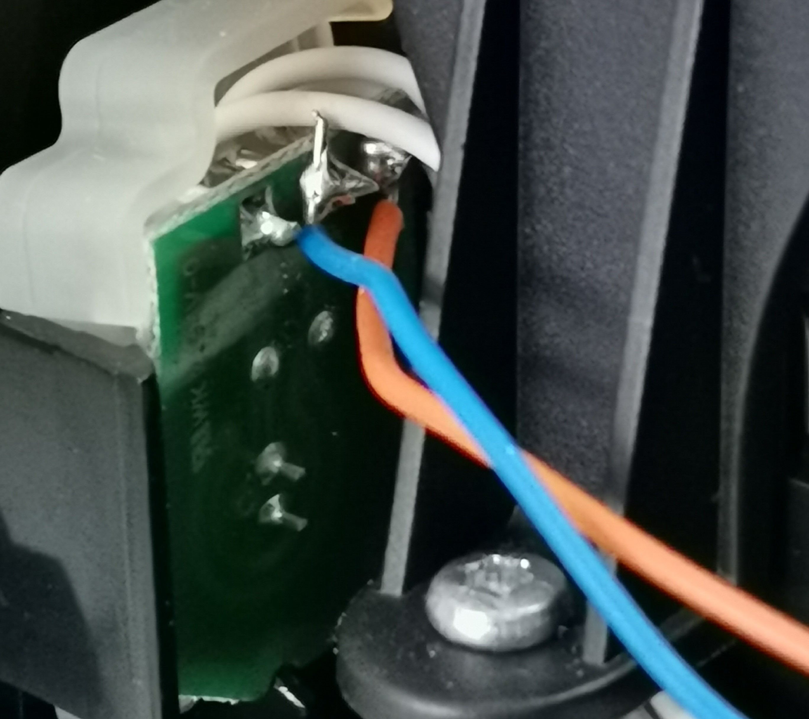
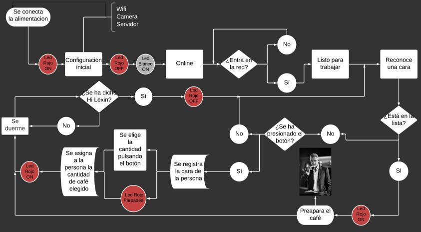

# Smart cofee maker with voice to wake up

## Key Features

- Voice wakeup
- Face detection
- Face recognition
- GPIO managment

#### 1. Networking

Users can connect their PCs or mobile phones to ESP-EYE's Wi-Fi (by default), with the following information:

- Username: esp-eye-xxxx (xxxx should be the board's MAC address)
- Password: esp_cafetera_19

Alternatively, users can also follow the steps below to configure the username and password of the board's Wi-Fi connection:

- Launch your Terminal.
- Run `make menuconfig` and complete the configuration, as instructed in the figure below:
	
	

> Note: After reconfiguring the Wi-Fi username and password, you will have to restart from the point of downloading firmware.

#### 2. Face Detection

ESP-EYE starts the face detection after networking. Users can see the real-time image captured by the board, through their browser (address: `192.168.6.1/face_stream`). During this step, the red LED is off and the white LED is on.

#### 3. Face Recognition

After detecting a face, ESP-EYE will start the face 
recognition if there are any enrolled Face IDs stored in the board:

- When there is a match, the red LED on the board flashes once and the browser displays **HELLO ID XXX**.
- When there is no match, the board shows no signs and the browser displays **WHO?**.

If there is no enrolled Face ID, the board continues the face-detecting process. You should enroll at least one Face ID if you want to start face 
recognition.

#### 4. Add a Face ID

- Single-click the Side Tactile Button to enroll a new Face ID. At this point, the red LED is on and the browser displays **START ENROLLING**;
- Once you put a face in front of the camera, the face-sampling starts automatically. The red LED flashes whenever the board gets a face sample and the browser displays the ordinal number of the current face sample, i.e. **THE 1st SAMPLE** etc. By default, the board has to take three samples to add one Face ID. Users can configure the number of samples needed for one Face ID. (Please adjust your position/distance from the camera and try again if you cannot see the red LED flashing for some time).
- After the Face ID enrollment, the red LED on the board is off and the browser displays **ENROLLED FACE ID XXX**;
- The board enters Face Detection after the Face ID enrollment.

Currently, ESP-EYE can enroll up to 10 Face IDs. Please note that the maximum number of enrolled Face IDs can be configured according to how users allocate the flash memory. However, we recommend a number that is no greater than 30.

#### 5. Voice Wake-up 

ESP-EYE awaits to be woken up after pour cofee or store a user (Red LED off and white LED on). The board wakes up after recognizing the wake-up command "Hi Lexin" ([Ləsɪ:n]), and then awaits to work. Subsequently, users can initiate the networking.

>Note: If you want to download an audio clip of our wake-up command "Hi Lexin", please click [here](https://dl.espressif.com/dl/Hi_Lexin_wake-up_commend.wav).

#### Use of peripherals

- After adding the face to the "member list" the red LED will begin to flash for 10 seconds, at this time the user must decide what amount of coffee he wants to drink, in this version of the code there are 3 possibilities depending on how many times you have Pressed the side button of the ESP-EYE:

-Coffee short: Without pressing

-Medium coffee: One press

-Long coffee: Two presses

- If the user has pressed more than twice the amount is reset to the minimum value (as if it had not been pressed).

- When a face that is in the "member list" is recognized again, the amount of coffee that the user has preset will be taken.

- The quantities of coffee are preset in a fixed time of 20, 40 and 60 seconds respectively, if you want to vary these times you should go to the app_httpserver.c file in the main folder and go to the coffeeteame function and change the vtask values at the time you want in milliseconds.

- Din and Cs pins are used, the first as an output signal and the second as ground, the assembly that was made is shown in the following image.

- Have been used, apart from the ESP-EYE, two resistors with the values indicated in the figure, a transistor 2N2222, a breadboard? and a Nespresso coffee maker? . To pour the coffee, you have to short-circuit the terminals of the switch, which in this model of coffee maker is seen in the following image:

#### Troubleshooting

The board returns to the "awaiting to be woken up" status when there are network anomalies, such as "network disconnection" and "network timeout".

#### Flowchart

A summary of the process of this system would be the following:

|||||||||||||||||||||||||||||||||||||||||||||||||||||||||||||||||||||||||||||||||||||

#### Uso de periféricos

- Después de añadir la cara a la "lista de miembros" el LED rojo comenzará a parpadear durante 10 segundos, en este tiempo el usuario debe decidir que cantidad de café quiere tomar, en esta versión del código hay 3 posibilidades dependiendo de cuantas veces has pulsado el botón lateral de la ESP-EYE:

	-Café corto: Sin pulsar
	
	-Café medio: Una pulsación
	
	-Café largo: Dos pulsaciones

- Si el usuario ha pulsado más de dos veces la cantidad se reinicia al valor mínimo (como si no se hubiese pulsado).

- Cuando se vuelve a reconocer una cara que esté en la "lista de miembros" se echará la cantidad de café que el usuario haya prefijado.

- Las cantidades de café están prefijadas en unos tiempos fijos de 20, 40 y 60 segundos respectivamente, si se quieren variar estos tiempos se debería ir al archivo app_httpserver.c en la carpeta main y dirigirse a la función cafeteame y cambiar los valores del vtask al tiempo que desee en milisegundos.

- Se utilizan los pines Din y Cs, el primero como señal de salida y el segundo como tierra, el montaje que se realizó se muestra en la siguiente imagen.

- Se a utilizado, a parte de la ESP-EYE, dos resistencias con los valores indicados en la figura, un transistor 2N2222, una breadboard? y una cafetera Nespresso ? . Para que eché el café, se tienen que cortocircuitar los bornes del interruptor, que en este modelo de cafetera se ve en la siguiente imagen:

#### Troubleshooting

The board returns to the "awaiting to be woken up" status when there are network anomalies, such as "network disconnection" and "network timeout".

#### Diagrama de flujo

Un resumen del proceso de este sistema sería el siguiente:

